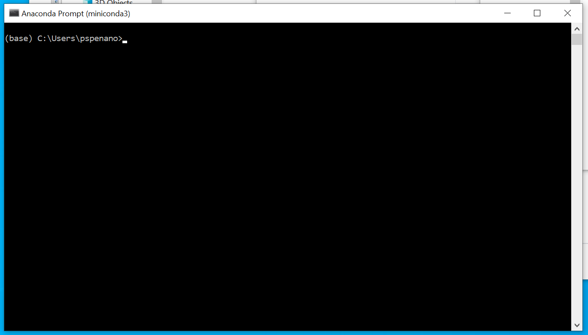
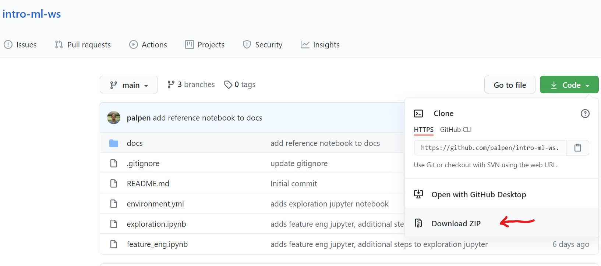
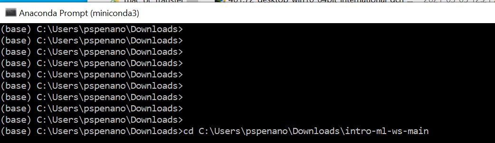
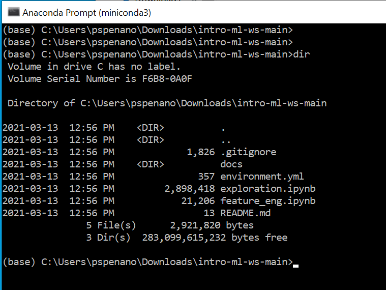
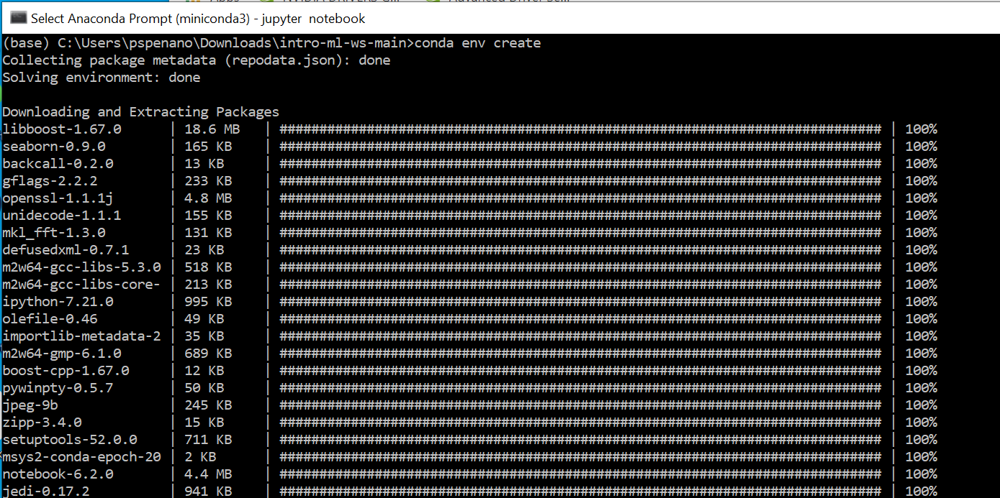
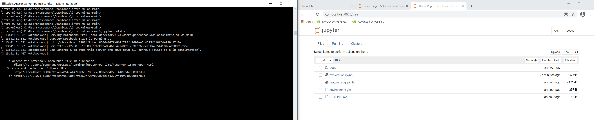

# Build a Loan Default Machine Learning Model using Python

#### Instructors

* Hudson Pimenta ([@hudsonps15](https://twitter.com/hudsonps15))
* Palermo Penano ([@pspenano](https://twitter.com/pspenano))

Materials for a 3-part machine learning workshop named "Build a Loan Default Machine Learning Model using Python"

The data used in the workshop is a csv file of accepted loan applications named `accepted_2007_to_2018Q4.csv.gz`. The dataset can be downloaded from Kaggle here

https://www.kaggle.com/wordsforthewise/lending-club

The workshop is split into 3 sessions the will cover the main parts of a standard data science machine learning development lifecycle

## Setting up development environment

### Windows

1. Go to https://docs.conda.io/en/latest/miniconda.html and download the Python 3.8 Miniconda3 Windows 64-bit file (the 64-bit version should work for most modern Windows operating system)

2. Open the `.exe` file and and follow the setup instructions. Say yes to all the default configuration without changing any of the recommended settings

3. Once installed, you can open a command line prompt by going to your search bar and typing "Anaconda Prompt". You should see a window open that looks like this

   

4. Download this repository as a zipped file from GitHub (or clone the repository if you have Git installed)

   

5. Extract all its contents to a directory on your computer. Note the path to the folder where the GitHub repository was extracted. You can get the folder location by right clicking on it and going to Properties

6. In the Anaconda Prompt, change the current directory to the folder you extracted.

   

   

   

   If you succesfully changed the working directory in the Anaconda Prompt to the project directory, you should be able to list all the files in the folder using the `dir` command

   

7. To build your development environment and install all the libraries required, run the command `conda env create` in the Anaconda Prompt inside of the GitHub project folder

   

   If succesful, you should have a conda environment named `intro-ml-ws` that will all the the library you need to follow this workshop and execute the codes in the notebook.

   You can list all the available conda environments by running the command `conda env list`

8. Activate the environment by executing `conda activate intro-ml-ws`. 

9. Start a notebook server by executing `jupyter notebook` 

   

   The server will be located in http://localhost:8888. Open this url in your favourite browser and click on any one of the files ending with `.ipynb`  to open a notebook.

### MacOS

